```{r setup, include=FALSE}
knitr::opts_chunk$set(echo = TRUE)
```

### **Exercise 1** 

In this section, we (i) list and justify the selection of nine macroeconomic variables used to forecast 'Hours Worked', (ii) Source and transform the data for the ten variables into a data matrix, and (iii) Plot the data matrix and comment with observations.

**Selections**\
To forecast Hours worked (Index), we selected:
- Household Savings Ratio (Proportion)
- Total Unemployed persons (000s); 
- CPI Index Change (Percent change from previous period); 
- Real Unit Labour Costs (Index); 
- GDP Growth (Chain Volume Measure, Percentage change)
- Inventories (Chain Volume Measure, $millions)
- Public Capital (Gross fixed capital formation - Chain volume measure, $millions)
- Disposable Income per Capita (Real net national disposable income per capita, $)
- Terms of Trade (Percentage change from previous period)

All measures are at the national level, seasonally adjusted and measured quarterly for consistency of the analysis.

Unemployment and Real Unit Labour Costs relate to Hours worked through obvious labour supply and demand relationships between price of labour (wages) as well as the size of the workforce. Household savings and Disposable Income will relate to Labour Supply and hence Hours Worked as agents supply less labour when they can rely on greater savings/income.

We consider GDP Growth, Terms of Trade, Public Capital and Inventories to have a relationship with Hours Worked, as when the demand for goods or level of investment changes (i.e. capital), this will affect the demand for labour for production, and thus the number of hours supplied by employers. Similarly there will be a relationship between CPI (prices of household goods and services purchased) and labour demand and supply, with employers and employees making decisions based on their expenditures.


``` {r, message=FALSE}
# INSTALLING REQUIRED PACKAGES
library(readrba)
library(readabs)
library(tidyr)
library(dplyr)
library(ggplot2)
library(lubridate)
library(reticulate)
library(mvtnorm)
library(HDInterval)
library(tinytex)
set.seed(123456)

# DATA COLLECTION AND TRANSFORMING

##VAR1
HOURS               = read_abs(series_id ="A2304428W")
HOURS               = HOURS %>%slice(-c(1:101))
HOURS               = HOURS[c(4,6)]

##VAR2
HHSAVINGS           = read_abs(series_id = "A2323382F")
HHSAVINGS           = HHSAVINGS %>%slice(-c(1:101))
HHSAVINGS           = HHSAVINGS[c(4,6)]

##VAR3
UNEMPLOYMENT        = read_abs(series_id = "A2454521V")
UNEMPLOYMENT        = UNEMPLOYMENT %>%slice(-c(1:109))
UNEMPLOYMENT        = UNEMPLOYMENT[c(4,6)]

##VAR4
CPI_CHANGE_Q        = read_abs(series_id = "A2325850V")
CPI_CHANGE_Q        = CPI_CHANGE_Q %>%slice(-c(1:153))
CPI_CHANGE_Q        = CPI_CHANGE_Q[c(4,6)]

##VAR5
REAL_LABOUR_COST    = read_abs(series_id = "A2433071F")
REAL_LABOUR_COST    = REAL_LABOUR_COST %>%slice(-c(1:5))
REAL_LABOUR_COST    = REAL_LABOUR_COST[c(4,6)]

##VAR6
GDP_PCT_CHANGE      = read_abs(series_id = "A2304370T")
GDP_PCT_CHANGE      = GDP_PCT_CHANGE %>%slice(-c(1:101))
GDP_PCT_CHANGE      = GDP_PCT_CHANGE[c(4,6)]

##VAR7
PUBLIC_CAPITAL      = read_abs(series_id = "A2454459T")
PUBLIC_CAPITAL      = PUBLIC_CAPITAL %>%slice(-c(1:109))
PUBLIC_CAPITAL      = PUBLIC_CAPITAL[c(4,6)]

##VAR8
INVENTORIES         = read_abs(series_id = "A3538852F")
INVENTORIES         = INVENTORIES %>%slice(-c(1:5))
INVENTORIES         = INVENTORIES[c(4,6)]

##VAR9
DISP_INC_PC         = read_abs(series_id = "A2304416L")
DISP_INC_PC         = DISP_INC_PC %>% slice(-c(1:101))
DISP_INC_PC         = DISP_INC_PC[c(4,6)]

##VAR10
TOT                 = read_abs(series_id = "A2304400V")
TOT                 = TOT %>% slice(-c(1:101))
TOT                 = TOT[c(4,6)]

# Create Y and X
y_VEC1              = merge(HOURS, HHSAVINGS, by = 'date')
y_VEC2              = merge(UNEMPLOYMENT, CPI_CHANGE_Q, by = 'date')
y_VEC3              = merge(REAL_LABOUR_COST, GDP_PCT_CHANGE, by ='date')
y_VEC4              = merge(PUBLIC_CAPITAL, INVENTORIES, by ='date')
y_VEC5              = merge(DISP_INC_PC, TOT, by ='date')

y1                  = merge(y_VEC1, y_VEC2, by = 'date')
y2                  = merge(y_VEC3, y_VEC4, by = 'date')
y3                  = merge(y1, y2, by ='date')

y                   = merge(y3, y_VEC5, by = 'date') 
y                   = y %>% slice(-c(1:8))
y                   = ts(y[,c(2:11)], start = c(1986,4), frequency = 4, names=c(
                          "Hours Worked","Household_Savings","Unemployment",
                          "CPI Change","Real Labour Costs",
                          "GDP % Change","Public Capital","Inventories",
                          "Disposable Income","Terms of Trade"))
#Plot macro data and comment on trends
plot(y)

```
**Observations**\
For many variables, we see an upward trend over time which follows Hours Worked (which has steadily increased over time). The trend is less obvious when considering variables which are percentage changes from the previous period. We also see a downward trend in real labour unit costs.


\newpage

## **Exercise 2**

In this section we document the likelihood function of the model, and the probability density function of A and Sigma which follows joint matrix-variate normal-inverse Wishart distribution, and includes two hyperparameters.

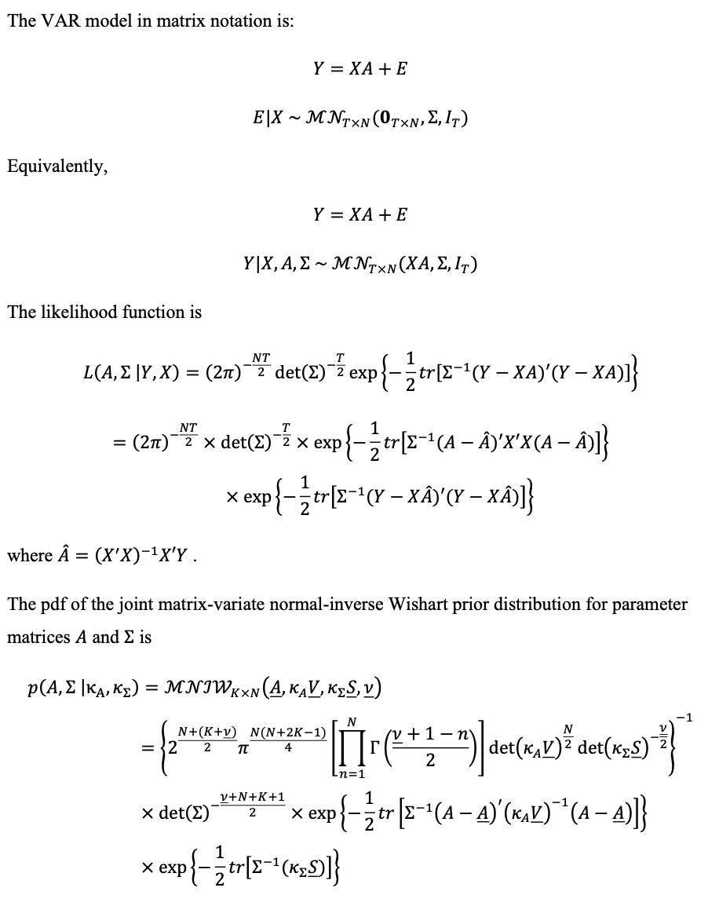

We also specify the parameters determining the prior distribution matrices

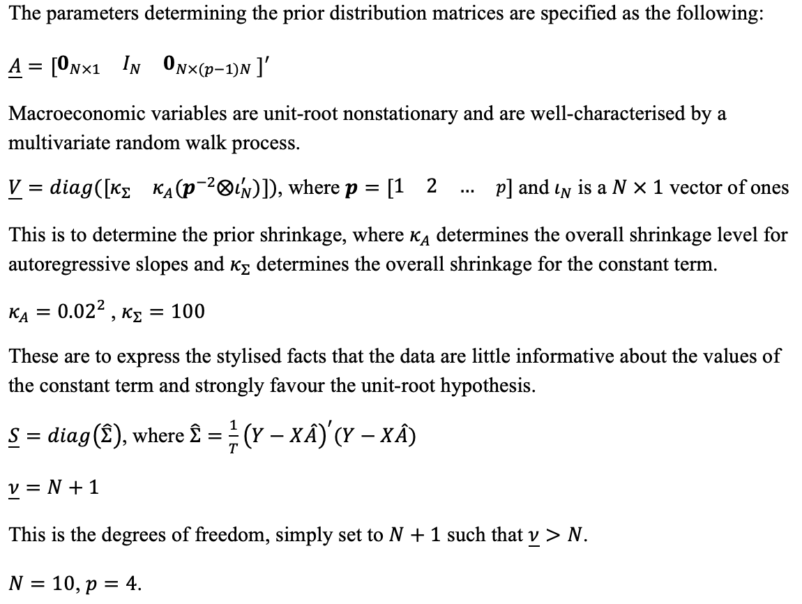

\newpage

## **Exercise 3 - Joint conditional posterior distribution**

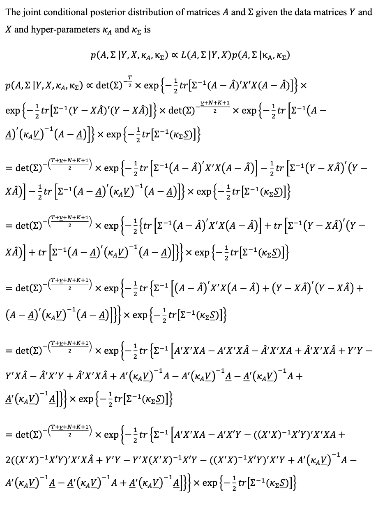

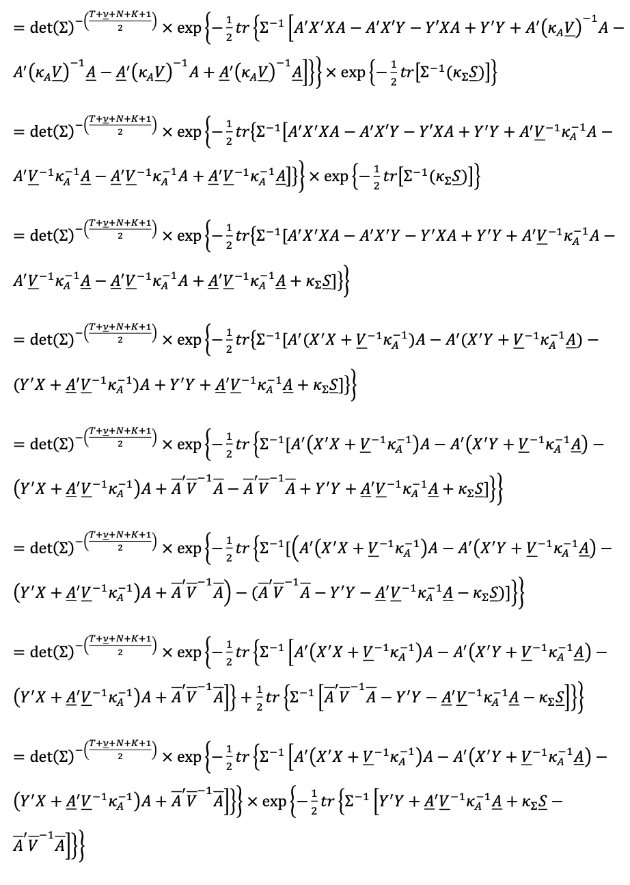

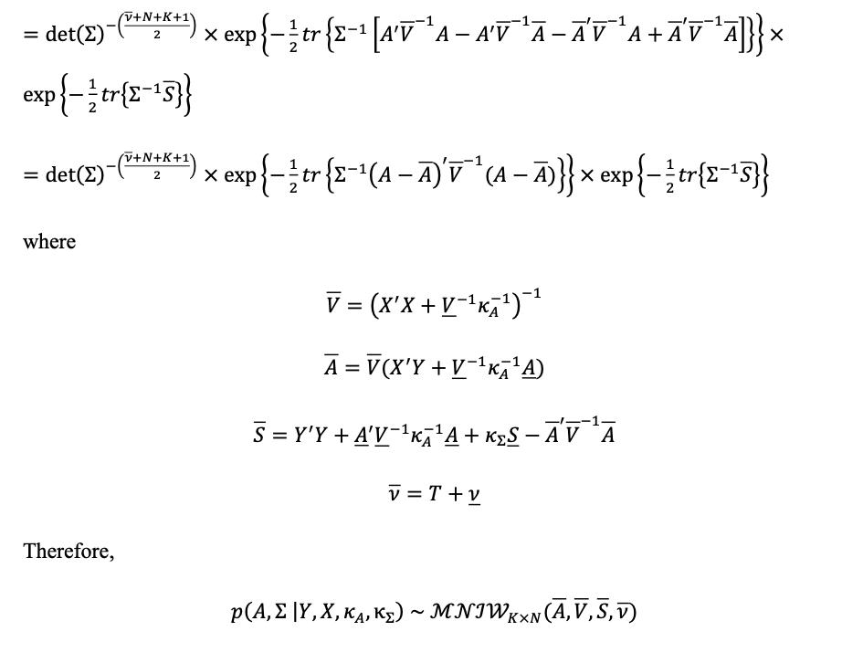

\newpage

## **Exercise 4**

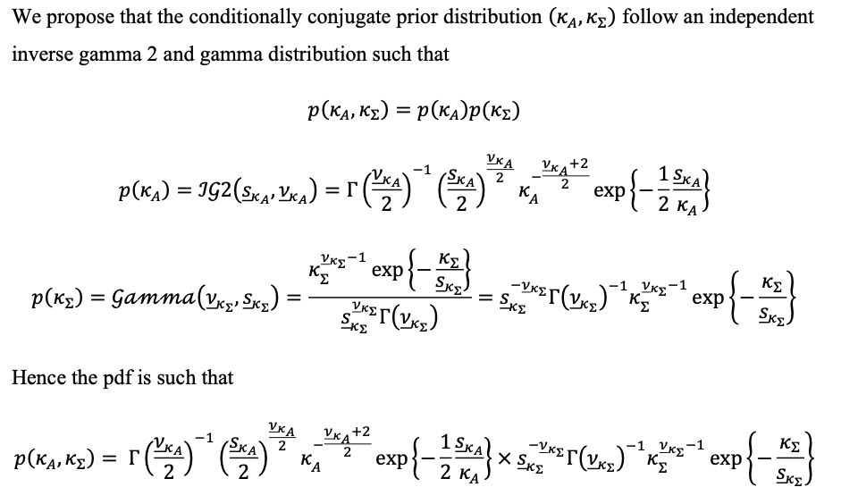

\newpage

## **Exercise 5**

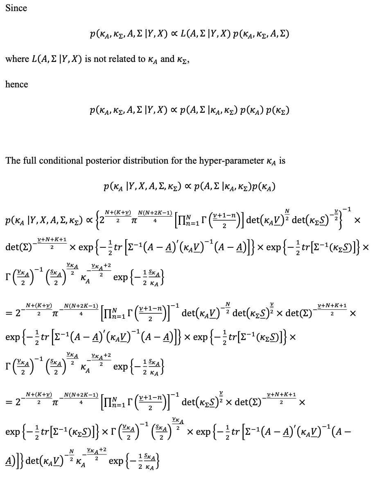 

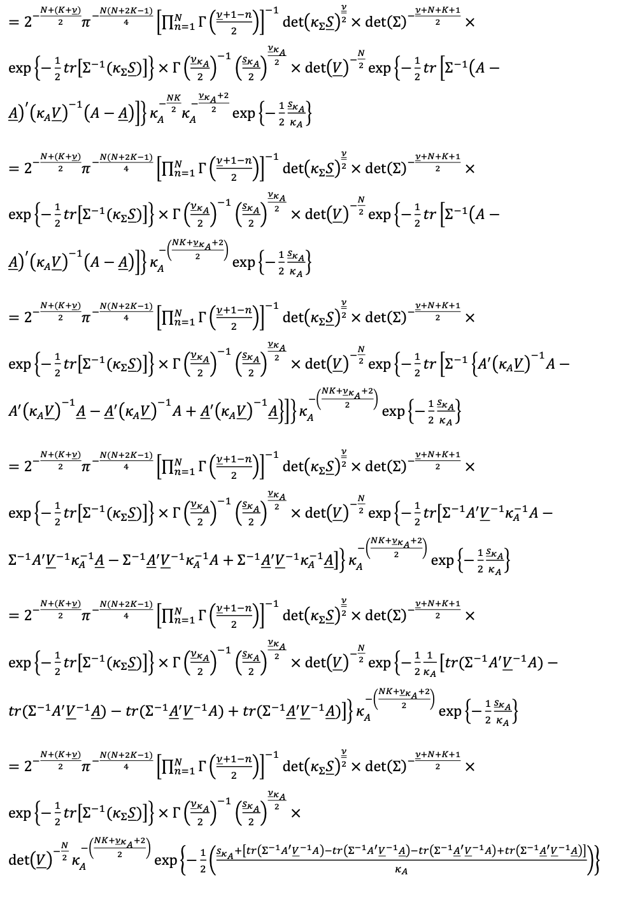 

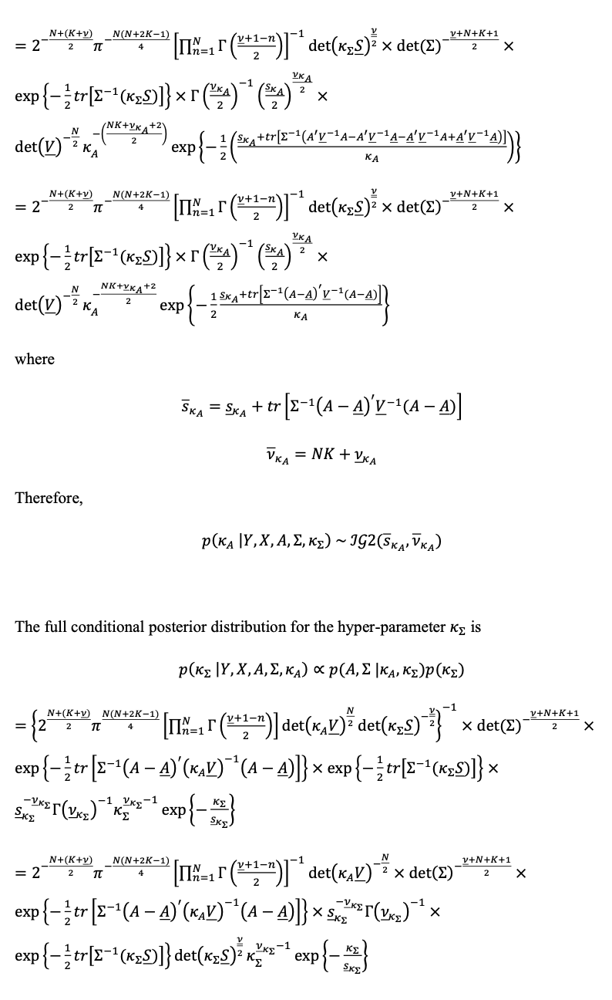 

<<<<<<< Updated upstream
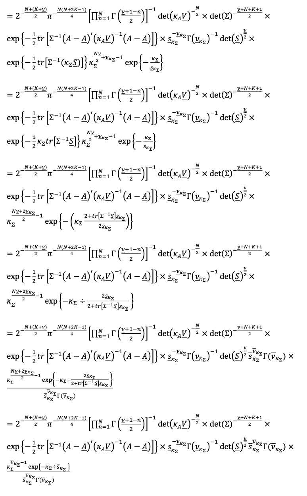 
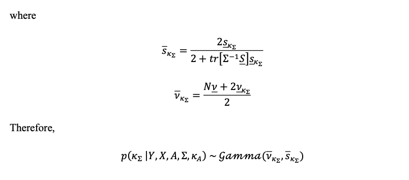
\newpage
## **Exercise 6 - Gibbs Sampler approach**
In this section we explain our Gibbs Sampler and the use of the full conditional posterior distributions.

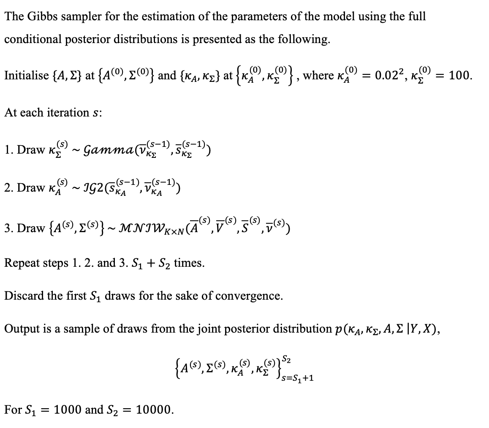

\newpage
### **Exercise 7 - Gibbs Sample R Function**
``` {r, message=FALSE}
#NOTE - R code must be included within these chunks (i.e. between these dotted lines) so R can interpret properly.
```

\newpage
### **Exercise 8 - Predictive Density approach **


\newpage
### **Exercise 9 - Predictive Density R Function**
``` {r, message=FALSE}
#NOTE - R code must be included within these chunks (i.e. between these dotted lines) so R can interpret properly.
```


\newpage

### **Exercise 10 - Parameter Estimates**

``` {r, message=FALSE}
#NOTE - R code must be included within these chunks (i.e. between these dotted lines) so R can interpret properly.
```

\newpage
### **Exercise 11 - Q4 2021 Forecast for 2022**

``` {r, message=FALSE}
#NOTE - R code must be included within these chunks (i.e. between these dotted lines) so R can interpret properly.
```
