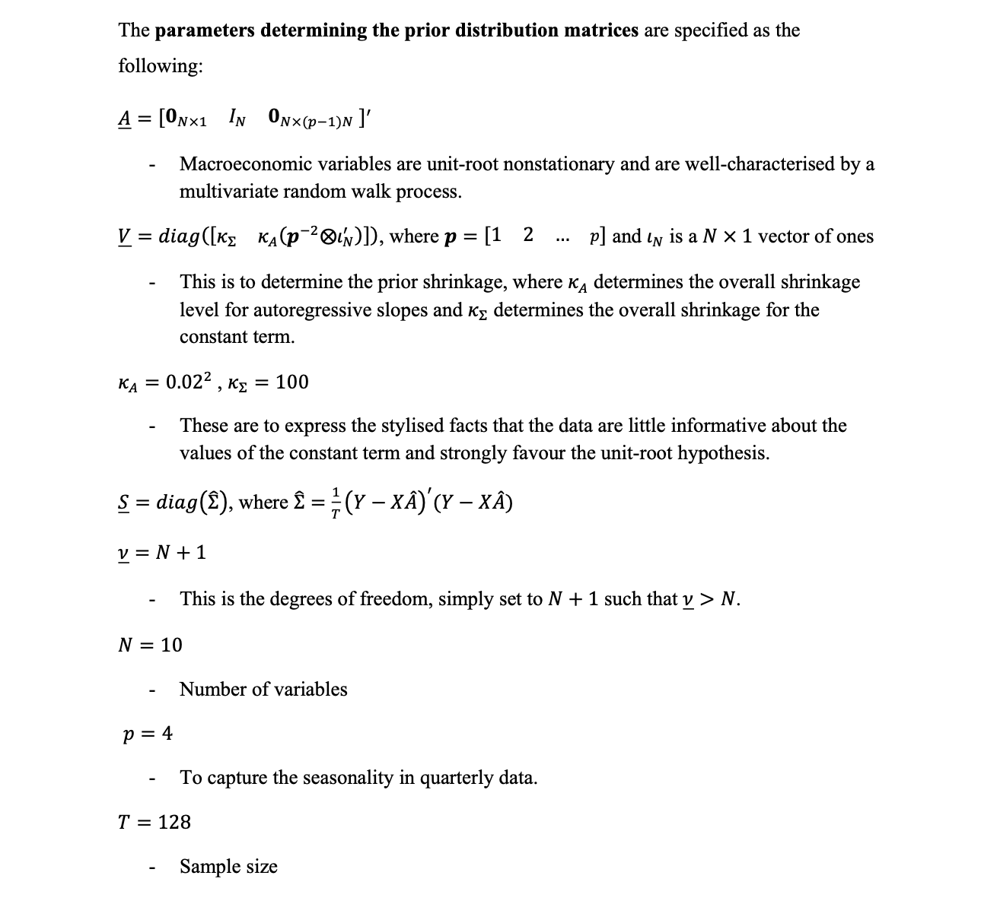
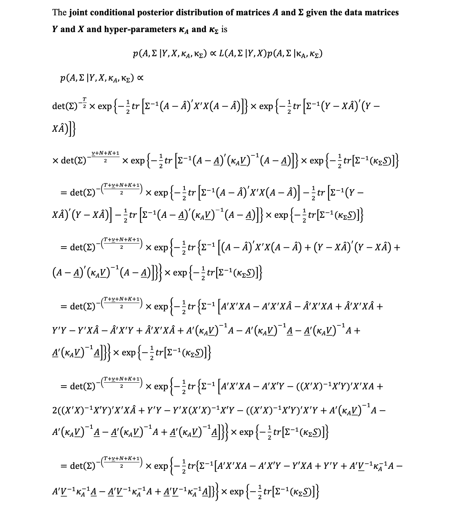
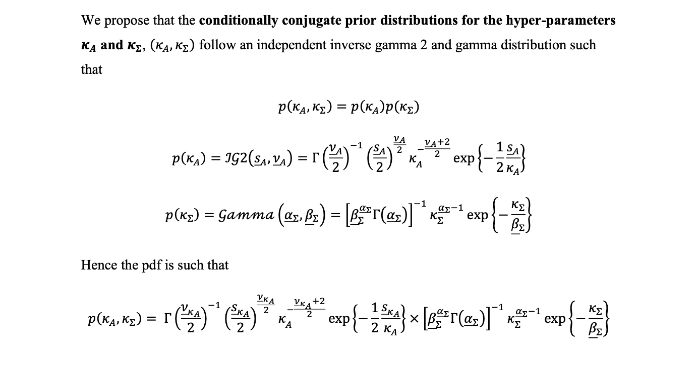

```{r setup, include=FALSE}
knitr::opts_chunk$set(echo = TRUE)
```

### **Exercise 1 - Variable selection** 

In this section, we (i) list and justify the selection of nine macroeconomic variables used to forecast 'Hours Worked', (ii) Source and transform the data for the ten variables into a data matrix, and (iii) Plot the data matrix and comment with observations.

**Selections**\
To forecast Hours worked (Index), we selected:
- Household Savings Ratio (Proportion)
- Total Unemployed persons (000s); 
- CPI Index Change (Percent change from previous period); 
- Real Unit Labour Costs (Index); 
- GDP Growth (Chain Volume Measure, Percentage change)
- Secondary Household income(Social assistance benefits) received ($millions)
- Inventories (Chain Volume Measure, $millions)
- Disposable Income per Capita (Real net national disposable income per capita, $)
- Terms of Trade (Percentage change from previous period)

All measures are at the national level, seasonally adjusted and measured quarterly for consistency of the analysis.

Unemployment and Real Unit Labour Costs relate to Hours worked through obvious labour supply and demand relationships between price of labour (wages) as well as the size of the workforce. Household savings, Secondary income (social benefits) and Disposable Income will relate to Labour Supply and hence Hours Worked as agents supply less labour when they can rely on greater savings/income.

We consider GDP Growth, Terms of Trade and Inventories to have a relationship with Hours Worked, as when the demand for goods, this will affect the demand for labour for production, and thus the number of hours supplied by employers. Similarly there will be a relationship between CPI (prices of household goods and services purchased) and labour demand and supply, with employers and employees making decisions based on their expenditures.


``` {r, message=FALSE}
# INSTALLING REQUIRED PACKAGES
rm(list=ls())
library(readrba)
library(readabs)
library(tidyr)
library(dplyr)
library(knitr)
library(ggplot2)
library(lubridate)
library(reticulate)
library(mvtnorm)
library(HDInterval)
library(xtable)
library(tinytex)
set.seed(123456)


# DATA COLLECTION AND TRANSFORMING
##VAR1
HOURS               = read_abs(series_id ="A2304428W")
HOURS               = HOURS %>%slice(-c(1:101))
HOURS               = HOURS[c(4,6)]

##VAR2
HHSAVINGS           = read_abs(series_id = "A2323382F")
HHSAVINGS           = HHSAVINGS %>%slice(-c(1:101))
HHSAVINGS           = HHSAVINGS[c(4,6)]

##VAR3
UNEMPLOYMENT          = read_abs(series_id = "A2454521V")
UNEMPLOYMENT          = UNEMPLOYMENT %>%slice(-c(1:109))
UNEMPLOYMENT          = UNEMPLOYMENT[c(4,6)]

##VAR4
CPI_CHANGE_Q        = read_abs(series_id = "A2325850V")
CPI_CHANGE_Q        = CPI_CHANGE_Q %>%slice(-c(1:153))
CPI_CHANGE_Q        = CPI_CHANGE_Q[c(4,6)]

##VAR5
REAL_LABOUR_COST    = read_abs(series_id = "A2433071F")
REAL_LABOUR_COST    = REAL_LABOUR_COST %>%slice(-c(1:5))
REAL_LABOUR_COST    = REAL_LABOUR_COST[c(4,6)]

##VAR6
GDP_PCT_CHANGE      = read_abs(series_id = "A2304370T")
GDP_PCT_CHANGE      = GDP_PCT_CHANGE %>%slice(-c(1:101))
GDP_PCT_CHANGE      = GDP_PCT_CHANGE[c(4,6)]

##VAR7
HH_SOCIAL_BENEFITS  = read_abs(series_id = "A2454564V")
HH_SOCIAL_BENEFITS  = HH_SOCIAL_BENEFITS %>%slice(-c(1:109))
HH_SOCIAL_BENEFITS  = HH_SOCIAL_BENEFITS[c(4,6)]


##VAR8
INVENTORIES         = read_abs(series_id = "A2454511R")
INVENTORIES         = INVENTORIES %>%slice(-c(1:5))
INVENTORIES         = INVENTORIES[c(4,6)]
INVENTORIES$value   = log(INVENTORIES$value)


##VAR9
DISP_INC_PC         = read_abs(series_id = "A2304416L")
DISP_INC_PC         = DISP_INC_PC %>% slice(-c(1:101))
DISP_INC_PC         = DISP_INC_PC[c(4,6)]
DISP_INC_PC$value   = log(DISP_INC_PC$value)


##VAR10
TOT                 = read_abs(series_id = "A2304400V")
TOT                 = TOT %>% slice(-c(1:101))
TOT                 = TOT[c(4,6)]

# Create Y and X
############################################################
y_VEC1              = merge(HOURS, HHSAVINGS, by = 'date')
y_VEC2              = merge(UNEMPLOYMENT, CPI_CHANGE_Q, by = 'date')
y_VEC3              = merge(REAL_LABOUR_COST, GDP_PCT_CHANGE, by ='date')
y_VEC4              = merge(HH_SOCIAL_BENEFITS, INVENTORIES, by ='date')
y_VEC5              = merge(DISP_INC_PC, TOT, by ='date')

y1                  = merge(y_VEC1, y_VEC2, by = 'date')
y2                  = merge(y_VEC3, y_VEC4, by = 'date')
y3                  = merge(y1, y2, by ='date')

y                   = merge(y3, y_VEC5, by = 'date') 
y                   = y %>% slice(-c(1:8))
y                   = ts(y[,c(2:11)], start = c(1986,4), frequency = 4, names=c(
                                        "Hours Worked","Household_Savings","Unemployed","CPI change",
                                        "Unit Labour Cost","GDP Growth","Social Welfare Income","Inventories",
                                        "Diposable Income per capita","Terms_of_Trade"))

#Plot macro data and comment on trends
plot(y, main = "Plots of our ten variables", cex.lab = 0.5, col = "blue")


```
**Observations**\
For many variables, we see an upward trend over time which follows Hours Worked (which has steadily increased over time). A trend is less obvious when considering variables which are percentage changes from the previous period. We also see a downward trend in real labour unit costs.


\newpage

## **Exercise 2 - Likelihood function and joint prior distribution for parameter matrices**

In this section we document the likelihood function of the model, and the probability density function of A and $\Sigma$ which follows joint matrix-variate normal-inverse Wishart distribution, and includes two hyperparameters.


We also specify the parameters determining the prior distribution matrices



\newpage

## **Exercise 3 - Joint conditional posterior distribution**




\newpage

## **Exercise 4 - Conditionally conjugate prior distributions for hyper-parameters**



\newpage

## **Exercise 5 -- Deriving Full Condition Posterior Distributions for the hyper-parameters**

$p(\kappa_A,\kappa_\Sigma,A,\Sigma | Y, X) \propto L(A,\Sigma|Y,X) p(\kappa_A,\kappa_\Sigma, A, \Sigma)$

We can further simplify as well as expand the Full Conditional Posterior for $\kappa_A$ using Bayes Rules to give:

$p(\kappa_A |Y, X,\kappa_\Sigma,A,\Sigma) \propto p(A,\Sigma | \kappa_A,\kappa_\Sigma)p(\kappa_A)p(\kappa_\Sigma)$

Where since we are conditioning on $\kappa_\Sigma$ the kernal of the distribution becomes:

 $p(\kappa_A |Y, X,\kappa_\Sigma,A,\Sigma) \propto det(\kappa_A \underline{V})^{(-\frac{N}{2})}\exp[-\frac{1}{2}tr(\Sigma^{-1}(A-\underline{A})^{'}(\kappa_A \underline{V})^{-1}(A-\underline{A}))](\kappa_A)^\frac{-(\underline{\nu}_A+2)}{2}\exp[-\frac{1}{2}\frac{\underline{s}_A}{\kappa_A}]$

$= [\kappa_A^Kdet(\underline{V})]^\frac{-N}{2}(\kappa_A)^\frac{-(\underline{\nu}_A+2)}{2}exp[-\frac{1}{2}\frac{\underline{s}_A + tr[\Sigma^{-1}(A-\underline{A})^{'}( \underline{V})^{-1}(A-\underline{A})]}{\kappa_A}$

$= \kappa_A^\frac{-(NK+\underline{\nu}_A+2)}{2}exp[-\frac{1}{2}\frac{\underline{s}_A + tr[\Sigma^{-1}(A-\underline{A})^{'}( \underline{V})^{-1}(A-\underline{A})]}{\kappa_A}$

Hence $\kappa_A \sim IG2(\bar{s}_A,\bar{\nu}_A)$

With : $\bar{s}_A =  \underline{s}_A + tr[\Sigma^{-1}(A-\underline{A})^{'}( \underline{V})^{-1}(A-\underline{A})]$

And : $ \bar{\nu}_A = \underline{\nu}_A +NK$

Following a similar approach for $\kappa_\Sigma$;

$p(\kappa_\Sigma |Y, X,\kappa_A,A,\Sigma) \propto p(A,\Sigma | \kappa_A,\kappa_\Sigma)p(\kappa_A)p(\kappa_\Sigma) $\\

$= det(\kappa_\Sigma \underline{S})^\frac{-\underline{\nu}}{2}exp\{-\frac{1}{2}tr(\Sigma^{-1}(\kappa_\Sigma\underline{S})\}exp\{-\frac{\kappa_\Sigma}{\underline{\beta}_\Sigma}(\kappa_\Sigma)^{\underline{\alpha}_\Sigma-1}\}$

$= \kappa_\Sigma^\frac{-N\underline{\nu}}{2} det(\underline{S})^\frac{\underline{\nu}}{2}exp(-\frac{1}{2}tr[\Sigma^{-1}(\kappa_\Sigma \underline{S})]+\frac{\kappa_\Sigma}{\underline{\beta}_\Sigma})$

$=\kappa_\Sigma^{\frac{-N\underline{\nu}}{2}+\underline{\alpha} -1}exp[(-\frac{1}{2}tr(\Sigma^{-1} \underline{S})+\frac{1}{\underline{\beta}_\Sigma})\kappa_\Sigma]$

Hence $\kappa_\Sigma \sim Gamma(\bar{\alpha}_\Sigma,\bar{\beta}_\Sigma)$

Where :$\bar{\alpha}_\Sigma = \underline{\alpha}_\Sigma -\frac{N\underline{\nu}}{2}$

And : $\bar{\beta}_\Sigma = \frac{1}{2}tr(\Sigma^{-1} \underline{S})+\frac{1}{\beta_\Sigma}$

\newpage

## **Exercise 6 - Gibbs Sampler approach**

The Gibbs Sampler used for the estimation of the parameters of the model using the full conditions is utilised by first initialising $A$ and $\Sigma$ at $\{ A{(0)}, \Sigma^{(0)}\}$ with both $\kappa_A$ and $\kappa_\Sigma$ at $\{\kappa_A^{(0)},\kappa^{(0)}_\Sigma\} $ where at each iteration $s$ we:\\

1. Sample $\kappa_\Sigma^{(s)} \sim p(\kappa_A | Y,X ,A^{(s-1)}, \Sigma^{(s-1)},\kappa_A^{(s-1)}) = Gamma(\bar{\alpha}_{A}^{(s-1)}, \bar{\beta}_{A}^{(s-1)})$\\
\\

2. Sample $\kappa_A^{(s)} \sim p(\kappa_A | Y,X ,A^{(s-1)}, \Sigma^{(s-1)},\kappa_\Sigma^{(s-1)} = IG2(\bar{\nu}_A^{(s-1)}, \bar{s}_A^{(s-1)})$\

3. Jointly Sample $\{A^{(s)},\Sigma^{(s)}\} \sim p(A,\Sigma | Y, X, \kappa_A^{(s)},\kappa_\Sigma^{(s)}) = MNIW_{(KxN)}(\bar{A}^{(s)}, \bar{V}^{(s)}, \bar{S}^{(s)}, \bar{\nu}^{(s)} )$\\

Which are then repeated for $S_1 + S_2 = 11,000$ where the we discard the first $S_1 = 1000$ draws to ensure convergence. The output from the Gibbs Sampler are the draws $\{A^{(s)}, \Sigma^{(s)}, \kappa_A^{(s)}, \kappa_\Sigma^{(s)} \}^{S_2}_{s=S_1}$ from the Joint Posterior distribution $p(A, \Sigma, \kappa_A, \kappa_\Sigma | Y, X )$.
\newpage

### **Exercise 7 - Gibbs Sample R Function**

``` {r, message=FALSE}

        N                   = 10
        p                   = 4
        K                   = 1+p*N
        S                   = 50
  


        # CREATE X AND Y MATRICES ############################################################
        
        Y                   = ts(y[(p+1):nrow(y),],start = c(1986,4), frequency = 4)
        X                   = matrix(1,nrow(Y),1)
        X                   = cbind(X,
                                    y[5:nrow(y)-1,],
                                    y[5:nrow(y)-2,],
                                    y[5:nrow(y)-3,],
                                    y[5:nrow(y)-4,]
        )
        
        TT                  = nrow(Y)
        T                   = TT - 1
        
        ## MLE
        A_HAT                 = solve(t(X)%*%X)%*%t(X)%*%Y
        SIGMA_HAT             = t(Y-X%*%A_HAT)%*%(Y-X%*%A_HAT)/T
        round(A_HAT,3)
        round(SIGMA_HAT,3)
        round(cov2cor(SIGMA_HAT),3)

    # PRIOR DISTRIBUTIONS SPECIFICATION
    ############################################################
    KAPPA_P_A             = 100
    KAPPA_P_E             = 0.02^2
    A_MEAN_PRI            = matrix(0, nrow(A_HAT),ncol(A_HAT))
    A_MEAN_PRI[2:11,]     = diag(10)
    V_PRIOR               = diag(c(KAPPA_P_E,KAPPA_P_A*((1:p)^(-2))%x%t(rep(1,N))))   # COL SPECIFIC VAR
    V_PRIOR_INV           = diag(1/c(KAPPA_P_E,KAPPA_P_A*((1:p)^(-2))%x%t(rep(1,N))))
    
    s.ols       = rep(NA,N)
    for (n in 1:N){
      s.ols[n]  = var(ar(x=Y[,n], aic=FALSE, order.max=8, method="ols")$resid[9:T])
    }
    
    #S_PRIOR               = diag(diag(SIGMA_HAT)) 
    S_PRIOR               = diag(s.ols)
    NU_PRIOR              = N+1
    
    A_PRIOR               = matrix(0, nrow(A_HAT),ncol(A_HAT))
    SIGMA_PRIOR           = diag(10)
    SIGMA_PRIOR_INV       = solve(SIGMA_PRIOR)
    
    # SPECIFYING HYPER-PARAMETERS
    hyper                 = list(0.1,3,0.1,3,A_MEAN_PRI,S_PRIOR,V_PRIOR, NU_PRIOR)
    names(hyper)          = c("S_PRIOR_Ka","V_PRIOR_KA","ALPHA_PRIOR_Ke","BETA_PRIOR_Ke","A_MEAN_PRI","S_PRIOR", "V_PRIOR", "NU_PRIOR")
    
    
    # POSTERIOR DRAWS
    posterior_A           = array(NA, c(S, K, N))
    posterior_E           = array(NA, c(N, N, S))
    posterior_ka          = matrix(NA, S)
    posterior_ke          = matrix(NA, S)
    
    GIBBS_SAMPLER = function(S, Y, X , hyper){
      
      for (s in 1:S){
        # HYPER-PARAMETER ESTIMATION -- K_E
        alpha_bar_ke        = hyper$ALPHA_PRIOR_Ke + ((hyper$V_PRIOR_KA*N))/2
        beta_bar_ke         = solve(hyper$BETA_PRIOR_Ke) + 0.5*sum(diag(solve(SIGMA_PRIOR)%*%hyper$S_PRIOR))
        
        # SAMPLING -- K_E
        KAPPA_P_E           = rgamma(1, shape = alpha_bar_ke, scale = beta_bar_ke)
        
        # HYPER-PARAMETER ESTIMATION -- K_A
        s_bar_ka            = sum(diag((solve(SIGMA_PRIOR)%*%t(A_PRIOR-hyper$A_MEAN_PRI))%*%(A_PRIOR-hyper$A_MEAN_PRI))) + hyper$S_PRIOR_Ka
        v_bar_ka            = hyper$V_PRIOR_KA + N*K
        
        # SAMPLING -- K_A
        KAPPA_P_A           = s_bar_ka/rchisq(1, v_bar_ka)
        
        # PARAMETERS OF MVNIW POSTERIOR
        V_bar_inv           = crossprod(X) + diag(1/diag(hyper$V_PRIOR))*(1/KAPPA_P_A)
        V_bar               = solve(V_bar_inv)
        A_bar               = V_bar%*%(t(X)%*%Y + (diag(1/diag(V_bar))*(1/KAPPA_P_A))%*%hyper$A_MEAN_PRI)
        
        S_bar               = KAPPA_P_E*hyper$S_PRIOR +crossprod(Y)+ t(hyper$A_MEAN_PRI)%*%((diag(1/diag(hyper$V_PRIOR)))*KAPPA_P_A)%*%hyper$A_MEAN_PRI - t(A_bar)%*%V_bar_inv%*%A_bar
        S_bar_inv           = solve(S_bar)
        nu_bar              = T + NU_PRIOR
    
        
        # SAMPLE -- aux_A & aux_E
        L                   = t(solve(chol(V_bar_inv)))
        SIGMA_POST          = solve(rWishart(1, df = nu_bar, Sigma =S_bar_inv)[,,1])
        draw.norm           = array(rnorm(prod(N*K)),c(K,N))
        A_POST              = A_bar + L%*%draw.norm%*% chol(SIGMA_POST)
        
        round(apply(A_POST,1:2, mean),3)
        
        posterior_ka[s]     = KAPPA_P_A
        posterior_ke[s]     = KAPPA_P_E
        posterior_A[s,,]    = A_POST
        posterior_E[,,s]    = SIGMA_POST
      }
      
      # OUTPUT  
      return(
        list(
          A           = posterior_A,
          E           = posterior_E,
          Ka          = posterior_ka,
          Ke          = posterior_ke
        )
      )
    }


```

\newpage
### **Exercise 8 - Predictive Density approach **
In order to generate the one year ahead forecasts we utilise the $s$ draws from the Posterior Density in Question 8 to iteratively sample from the 1-period ahead density, then the 2-period ahead density until we reach the desired forecast horizon. 

In other words we use each of the $s$ draws of $A^{(s)}$ and $\Sigma^{(s)}$ from the Gibbs Sampler output to sample:

$y^{(s)}_{t+1} \sim N_N(u^{(s)}+A_1^{(s)}y_t+A_2^{(s)}y_{t-1}+A_3^{(s)}y_{t-2}+A_4^{(s)}y_{t-3},\Sigma^{(s)})$

Which is then use to sample $y^{(s)}_{t+2}$:

$y^{(s)}_{t+2} \sim N_N(u^{(s)}+A_1^{(s)}y_{t+1}+A_2^{(s)}y_{t}+A_3^{(s)}y_{t-1}+A_4^{(s)}y_{t-2},\Sigma^{(s)})$

Where we continue to iterate until the desired 4-period ahead forecast is sampled from:

$y^{(s)}_{t+4} \sim N_N(u^{(s)}+A_1^{(s)}y_{t+3}+A_2^{(s)}y_{t}+A_3^{(s)}y_{t+2}+A_4^{(s)}y_{t+1},\Sigma^{(s)})$

Allowing us to obtain a (10 x 4 x S) array of forecasts $y_{t+1}^{(s)},...,y_{t+4}^{(s)}^{S=1000}_s=1$ for each period up until the desired forecast horizon.

\newpage
### **Exercise 9 - Predictive Density R Function**

``` {r, message=FALSE}
h               = 4
Y.h             = array(NA,c(h,10,S))
Y.h.m           = array(NA,c(h,10))

FORECAST_FUNCTION = function(h,SAMPLER_OUTPUT){
  for (s in 1:S){
    if (p==1){
      x.Ti          = matrix(Y[(nrow(Y)-p+1):nrow(Y),],nrow=1)
      x.Ti.m        = x.Ti
    } else {
      x.Ti          = Y[(nrow(Y)-p+1):nrow(Y),]
      x.Ti          = x.Ti[p:1,]
      x.Ti.m        = x.Ti
    }
    for (i in 1:h){
      x.T           = c(1,as.vector(t(x.Ti)))
      x.T.m         = c(1,as.vector(t(x.Ti.m)))
      Y.f           = rmvnorm(1, mean = x.T%*%SAMPLER_OUTPUT$A[s,,], sigma=SAMPLER_OUTPUT$E[,,s])
      Y.f.m         = x.T.m%*%SAMPLER_OUTPUT$A[s,,]
      if (p==1){
        x.Ti        = Y.f
        x.Ti.m      = Y.f.m
      } else {
        x.Ti        = rbind(Y.f,x.Ti[1:(p-1),])
        x.Ti.m      = rbind(Y.f.m,x.Ti.m[1:(p-1),])
      }
      Y.h[i,,s]     = Y.f[1:2]
      Y.h.m[i,]     = Y.f.m[1:2]
    }
  }
  
  # OUTPUT  
  return(
    list(
      Y_FORECAST    = Y.h,
      Y_M_FORECAST  = Y.h.m
    )
  )
}

```

\newpage

### **Exercise 10 - Parameter Estimates**

``` {r, message=FALSE}

SAMPLER_OUTPUT = GIBBS_SAMPLER(S, Y , X, hyper)

# POSTERIOR MEANS 
A_SAMP_MEAN               = round(apply(SAMPLER_OUTPUT$A,2:3,mean),3)
A_SAMP_SD                 = round(apply(SAMPLER_OUTPUT$A,2:3,sd),3)
SIGMA_SAMP_MEAN           = round(apply(SAMPLER_OUTPUT$E,1:2,mean),3)
SIGMA_SAMP_SD             = round(apply(SAMPLER_OUTPUT$E,1:2,sd),3)

# LIST CONTAINING A=[u0,A1,A2,A3,A4]
A_LIST                    = list(A_SAMP_MEAN[1,],
                                  A_SAMP_MEAN[2:11,],
                                  A_SAMP_MEAN[12:21,],
                                  A_SAMP_MEAN[22:31,],
                                  A_SAMP_MEAN[32:41,])
                                 
A_SD                      = list(A_SAMP_SD[1,],
                                  A_SAMP_SD[2:11,],
                                  A_SAMP_SD[12:21,],
                                  A_SAMP_SD[22:31,],
                                  A_SAMP_SD[32:41,])

OUTPUT_A_MEAN             =A_SAMP_MEAN[2:11,]
OUTPUT_A_SD               =A_SAMP_SD[2:11,]

A1_MEAN_TABLE             = kable(round(OUTPUT_A_MEAN,5), caption="A_1 Posterior Mean Estimates of AR(4) Model")
A1_SD_TABLE               = kable(round(OUTPUT_A_SD,5), caption="A_1 Posterior SD Estimates of AR(4) Model")

## TRACE-PLOTS
plot.ts(SAMPLER_OUTPUT$A[1000:S], main = "trace plots", xlab = "", ylab = "A")
plot.ts(SAMPLER_OUTPUT$E[1000:S], main = "trace plots", xlab = "", ylab = "E")
plot.ts(SAMPLER_OUTPUT$Ka[1000:S], main = "trace plots", xlab = "", ylab = "Ka")
plot.ts(SAMPLER_OUTPUT$Ke[1000:S], main = "trace plots", xlab = "", ylab = "Ke")

## HISTOGRAMS
hist(SAMPLER_OUTPUT$A[1000:S], main = "histograms", xlab = "",ylab = "A", col = mcxs2, breaks = 25)
hist(SAMPLER_OUTPUT$E[1000:S], main = "histograms", xlab = "",ylab = "E", col = mcxs2, breaks = 25)
hist(SAMPLER_OUTPUT$Ka[1000:S], main = "histograms", xlab = "",ylab = "Ka", col = mcxs2, breaks = 25)
hist(SAMPLER_OUTPUT$Ke[1000:S], main = "histograms", xlab = "",ylab = "Ke", col = mcxs2, breaks = 25)


```
It is evident from the oscillation about constant values in the trace plots for the parameters $A, \kappa_A, \kappa_\Sigma$ that there is some distributional convergence in the Markov Chain. The histogram for parameter $A$ shows that it is seemingly normally distributed centered at a value close to zero. 

For both the hyper-parameters $\kappa_A$ and $\kappa_\Sigma$ the distributions are centered around 0.022 and $1.5 x 10^7$ respectively. The large estimates of the shrinkage parameters $\kappa_\Sigma$ is caused by the consistent deviation of the distributional mass of the posterior from its mean. Both parameters have right-skewed distributional shapes with $\kappa_\Sigma$ exhibiting a slightly higher modal concentration and defined right-tail. 

Lastly the histogram of for the parameter $\Sigma$ is highly concentrated distribution centered around 0 with a relatively small amount of positive outliers visible.

Upon further inspection when analysing the posterior mean estimates for the parameter matrix of autoregressive parameter $A_1$ we see extremely large mean values for variables in columns 7,8 and 9. This is potentially caused by highly collinearity between these variables and our variables of interest leading to issues in model parameter estimation and forecasting

\newpage
### **Exercise 11 - Q4 2021 Forecast for 2022**

``` {r, message=FALSE}
# FORECAST FUCNTIONS & PULLING ESTIMATES
FORECAST                = FORECAST_FUNCTION(h, SAMPLER_OUTPUT)

FORECAST_YH             = FORECAST$Y_FORECAST
FORECAST_YHM            = FORECAST$Y_M_FORECAST

# CALCULATING AVERAGES + SD
FORECAST_YH_AVG         = round(apply(FORECAST$Y_FORECAST,1:2,mean),3)
FORECAST_YH_SD          = round(apply(FORECAST$Y_FORECAST,1:2,sd),3)

FORECAST_YHM_AVG        = apply(FORECAST$Y_M_FORECAST,1:2,mean)
FORECAST_YHM_SD         = apply(FORECAST$Y_M_FORECAST,1:2,sd)

xx = xtable(rbind(format(t(FORECAST_YH_AVG[1:4,1]),digits=1, scientific=FALSE)[1,],
             format(t(FORECAST_YH_SD[1:4,1]),digits=1, scientific=FALSE)[1,])
            
             format(t(FORECAST_YHM_AVG[1:4,1]),digits=1, scientific=FALSE)[2,],
             format(t(FORECAST_YHM_SD[1:4,1]),digits=1, scientific=FALSE)[2,]))

OUTPUT                  = cbind(c(t(FORECAST_YH_AVG[1:4,1])), c(t(FORECAST_YH_SD[1:4,1])))
colnames(OUTPUT)        = c("h-Period Forecast Mean", "h-Period Forecast SD")
```
It is clear from the mean forecasts of the 4-period ahead model that there are some issues within the estimation that are causing extremely large and unrealistic values to be achieved. The 1-period ahead forecast for hours worked is estimated to be a value $2909$ which is exponentially larger than the last observed data point of $102.3$ with the forecast becoming increasingly larger in magnitude and variance as the horizon extends. 

As stated in the prior question - the issue most likely stems from the collinearity of choice variables used in the estimation with our variable of interest. Due to the extreme scale of these forecast values graphing of the model becomes extremely difficult due to scaling especially when considering the 4-period ahead estimate of $3*10^{15}$.

\newpage
### **Exercise 12 - RMSFE**

``` {r, message=FALSE}
I                             = 8
FORECAST_YH_LOOP              = array(NA,c(h,10,S,I))
FORECAST_YHM_LOOP             = array(NA,c(h,10,I))

for (i in 1:I){
  Y_LOOP                   = Y[1:120+i,]
  X_LOOP                   = X[1:120+i,]
  T = nrow(Y_LOOP)
  
  A_HAT                 = solve(t(X_LOOP)%*%X_LOOP)%*%t(X_LOOP)%*%Y_LOOP
  SIGMA_HAT             = t(Y_LOOP-X_LOOP%*%A_HAT)%*%(Y_LOOP-X_LOOP%*%A_HAT)/T
  round(A_HAT,3)
  round(SIGMA_HAT,3)
  round(cov2cor(SIGMA_HAT),3)
  
  KAPPA_P_A             = 100
  KAPPA_P_E             = 0.02^2
  A_MEAN_PRI            = matrix(0, nrow(A_HAT),ncol(A_HAT))
  A_MEAN_PRI[2:11,]     = diag(10)
  V_PRIOR               = diag(c(KAPPA_P_E,KAPPA_P_A*((1:p)^(-2))%x%t(rep(1,N))))   # COL SPECIFIC VAR
  V_PRIOR_INV           = diag(1/c(KAPPA_P_E,KAPPA_P_A*((1:p)^(-2))%x%t(rep(1,N))))
  s.ols       = rep(NA,N)
  for (n in 1:N){
    s.ols[n]  = var(ar(x=Y[,n], aic=FALSE, order.max=8, method="ols")$resid[9:T])
  }
  S_PRIOR               = diag(s.ols)
  NU_PRIOR              = N+1
  
  A_PRIOR               = matrix(0, nrow(A_HAT),ncol(A_HAT))
  SIGMA_PRIOR           = diag(10)
  SIGMA_PRIOR_INV       = solve(SIGMA_PRIOR)
  
  hyper                 = list(1,1,1,1,A_MEAN_PRI,S_PRIOR,V_PRIOR, NU_PRIOR)
  names(hyper)          = c("S_PRIOR_Ka","V_PRIOR_KA","ALPHA_PRIOR_Ke","BETA_PRIOR_Ke","A_MEAN_PRI","S_PRIOR", "V_PRIOR", "NU_PRIOR")
  
  posterior_A           = array(NA, c(S, K, N))
  posterior_E           = array(NA, c(N, N, S))
  posterior_ka          = matrix(NA, S)
  posterior_ke          = matrix(NA, S)
  
  SAMPLER_OUTPUT = GIBBS_SAMPLER(S, Y_LOOP , X_LOOP, hyper)
  FORECAST = FORECAST_FUNCTION(h, SAMPLER_OUTPUT)
  
  FORECAST_YH_LOOP[,,,i]             = FORECAST$Y_FORECAST
  FORECAST_YHM_LOOP[,,i]             = FORECAST$Y_M_FORECAST
}

I_FORECAST_YH_AVGs            = apply(FORECAST_YH_LOOP,c(1,4), mean)
RMSFE                         = matrix(NA,h,I)
i=1
for(i in 1:8){
  RMSFE[,i] =  t(y[((121+i):(124+i)),i]) - I_FORECAST_YH_AVGs[,i]
}
OUTPUT = RMSFE[1]
RMSFE
```
As postured in prior question answers, there are extreme issues in the model forecast estimation evident by this extraordinary large Root Mean Square Forecast Error. 

This is a clear indication that the model is not yet fully-refined and if not constrained by time it would be beneficial to seek out, and identify more appropriate variables to use in the forecast estimation of hours worked.